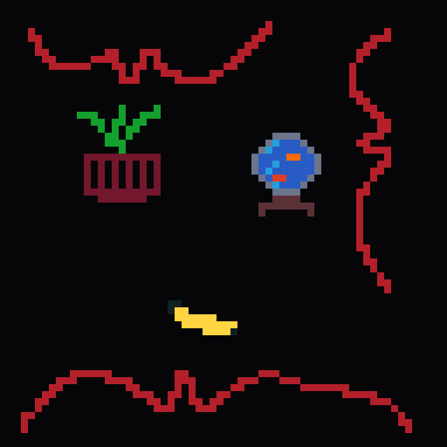

# nodit


[](https://docs.rs/nodit)
[](https://github.com/ripytide)
[](https://crates.io/crates/nodit)

<p align="center">

</p>

This crate provides [`NoditMap`], [`NoditSet`] and [`ZosditMap`], Discrete
Interval Tree data-structures, which are based off [`BTreeMap`].

`no_std` is supported and should work with the default features.

## `Copy` is partially required

Due to implementation complications with non-`Copy` types the
datastructures currently require both the interval type and the points the
intervals are over to be `Copy`. However, the value type used when using
the [`NoditMap`] does not have to be `Copy`. In fact the only
required traits on the value type are sometimes `Clone` or `Eq` but only
for some methods so if in doubt check a methods trait bounds.

## Example using an Inclusive-Exclusive interval

```rust
use nodit::interval::ie;
use nodit::NoditMap;

let mut map = NoditMap::new();

map.insert_strict(ie(0, 5), true);
map.insert_strict(ie(5, 10), false);

assert_eq!(map.overlaps(ie(-2, 12)), true);
assert_eq!(map.contains_point(20), false);
assert_eq!(map.contains_point(5), true);
```

## Example using a custom interval type

```rust
use std::ops::{Bound, RangeBounds};

use nodit::interval::ie;
use nodit::{
	DiscreteFinite, InclusiveInterval, Interval, NoditMap,
};

#[derive(Debug, Copy, Clone)]
enum Reservation {
	// Start, End (Inclusive-Inclusive)
	Finite(i8, i8),
	// Start (Inclusive-Infinity)
	Infinite(i8),
}

// First, we need to implement InclusiveInterval
impl InclusiveInterval<i8> for Reservation {
	fn start(&self) -> i8 {
		match self {
			Reservation::Finite(start, _) => *start,
			Reservation::Infinite(start) => *start,
		}
	}
	fn end(&self) -> i8 {
		match self {
			Reservation::Finite(_, end) => *end,
			Reservation::Infinite(_) => i8::MAX,
		}
	}
}

// Second, we need to implement From<Interval<i8>>
impl From<Interval<i8>> for Reservation {
	fn from(value: Interval<i8>) -> Self {
		if value.end() == i8::MAX {
			Reservation::Infinite(value.start())
		} else {
			Reservation::Finite(
				value.start(),
				value.end().up().unwrap(),
			)
		}
	}
}

// Next we can create a custom typed NoditMap
let reservation_map = NoditMap::from_slice_strict([
	(Reservation::Finite(10, 20), "Ferris".to_string()),
	(Reservation::Infinite(21), "Corro".to_string()),
])
.unwrap();

for (reservation, name) in reservation_map.overlapping(ie(16, 17))
{
	println!(
		"{name} has reserved {reservation:?} inside the interval 16..17"
	);
}

for (reservation, name) in reservation_map.iter() {
	println!("{name} has reserved {reservation:?}");
}

assert_eq!(
	reservation_map.overlaps(Reservation::Infinite(0)),
	true
);
```

## Key Understandings and Philosophies

### Discrete-ness

This crate is designed to work with [`Discrete`] types as compared to
[`Continuous`] types. For example, `u8` is a `Discrete` type, but
`String` is a `Continuous` if you try to parse it as a decimal value.

The reason for this is that common [`interval-Mathematics`] operations
differ depending on whether the underlying type is `Discrete` or
`Continuous`. For example `5..=6` touches `7..=8` since integers are
`Discrete` but `5.0..=6.0` does **not** touch `7.0..=8.0` since the
value `6.5` exists.

Importantly, this also makes Inclusive/Exclusive ended intervals really
easy to work with as they can be losslessly converted between one
another. For example, `3..6` is equivalent to `3..=5`.

### Finite-ness

At the moment this crate is also designed to work only with [`Finite`]
types such as `u8` or `i128`, but not with `Infinite` types such as
[`BigInt`] from the [`num_bigint`] crate. This is because the
[`get_key_value_at_point()`] method would not be able to return anything
from an empty map if the type was an infinite type such as `BigInt`
since it has no maximum value.

A handy trick you can use to pretend to have infinite types when you
don't expect to reach to top end of your type is to use [`Actual
Infinity`] to pretend you have an `Infinity`. For example, if you were
using `u8` as your point type then you could create a wrapper type such
as this:

```rust
use std::cmp::Ordering;

use nodit::DiscreteFinite;

#[derive(Debug, Clone, Copy, PartialEq, Eq)]
enum WithInfinity<T> {
	Finite(T),
	Infinity,
}

impl<T> Ord for WithInfinity<T>
where
	T: Ord,
{
	fn cmp(&self, other: &Self) -> Ordering {
		match (self, other) {
			(
				WithInfinity::Finite(x),
				WithInfinity::Finite(y),
			) => x.cmp(y),
			(WithInfinity::Finite(_), WithInfinity::Infinity) => {
				Ordering::Less
			}
			(WithInfinity::Infinity, WithInfinity::Finite(_)) => {
				Ordering::Greater
			}
			(WithInfinity::Infinity, WithInfinity::Infinity) => {
				Ordering::Equal
			}
		}
	}
}

impl<T> PartialOrd for WithInfinity<T>
where
	T: Ord,
{
	fn partial_cmp(&self, other: &Self) -> Option<Ordering> {
		Some(self.cmp(other))
	}
}

impl<T> DiscreteFinite for WithInfinity<T>
where
	T: DiscreteFinite,
{
	const MIN: Self = WithInfinity::Finite(T::MIN);
	const MAX: Self = WithInfinity::Infinity;

	fn up(self) -> Option<Self>
	where
		Self: Sized,
	{
		match self {
			WithInfinity::Finite(x) => match x.up() {
				Some(y) => Some(WithInfinity::Finite(y)),
				None => Some(WithInfinity::Infinity),
			},
			WithInfinity::Infinity => None,
		}
	}
	fn down(self) -> Option<Self>
	where
		Self: Sized,
	{
		match self {
			WithInfinity::Finite(x) => {
				Some(WithInfinity::Finite(x.down()?))
			}
			WithInfinity::Infinity => {
				Some(WithInfinity::Finite(T::MAX))
			}
		}
	}
}

// And then you this means you can be explicit with when
// Infinity is encountered such as when it might be
// returned by `get_key_value_at_point()`, for example:

use nodit::interval::uu;
use nodit::{Interval, NoditMap};

let map: NoditMap<
	WithInfinity<u8>,
	Interval<WithInfinity<u8>>,
	bool,
> = NoditMap::new();

let mut gap = map.get_key_value_at_point(WithInfinity::Finite(4));

assert_eq!(gap, Err(uu()));
```

### Invalid Intervals

Within this crate, not all intervals are considered valid intervals. The
definition of the validity of a interval used within this crate is that a
interval is only valid if it contains at least one value of the underlying
domain.

For example, `4..6` is considered valid as it contains the values `4`
and `5`, however, `4..4` is considered invalid as it contains no
values. Another example of invalid interval are those whose start values
are greater than their end values. such as `5..2` or `100..=40`.

Here are a few examples of intervals and whether they are valid:

| interval                                  | valid |
| -------------------------------------- | ----- |
| 0..=0                                  | YES   |
| 0..0                                   | NO    |
| 0..1                                   | YES   |
| 9..8                                   | NO    |
| (Bound::Excluded(3), Bound::Excluded(4)) | NO    |
| 400..=400                              | YES   |

### Overlap

Two intervals are "overlapping" if there exists a point that is contained
within both intervals. For example, `2..4` and `2..6` overlap but `2..4`
and `4..8` do not.

### Touching

Two intervals are "touching" if they do not overlap and there exists no
value between them. For example, `2..4` and `4..6` are touching but
`2..4` and `6..8` are not, neither are `2..6` and `4..8`.

### Further Reading

See Wikipedia's article on mathematical Intervals:
<https://en.wikipedia.org/wiki/Interval_(mathematics)>

## Features

This crate currently has no features

## Credit

Lots of my inspiration came from the [`rangemap`] crate.

The BTreeMap implementation ([`btree_monstrousity`]) used under the
hood was inspired and forked from the [`copse`] crate.

## Name Changes

This crate was previously named [`range_bounds_map`] it was renamed around about 2023-04-24 to
[`discrete_range_map`] due to it no longer being an accurate name.

This crate was renamed again on 2023-01-02 from [`discrete_range_map`] to [`nodit`] for a
similar reason, hopefully given the abstractness of the new name it will never need to change
again.

## Similar Crates

Here are some relevant crates I found whilst searching around the
topic area, beware my biases when reading:

- <https://docs.rs/rangemap>
  Very similar to this crate but can only use std [`Range`]s and
  [`RangeInclusive`]s as keys in it's `map` and `set` structs (separately).
- <https://docs.rs/btree-range-map>
- <https://docs.rs/ranges>
  Cool library for fully-generic ranges (unlike std::ops ranges), along
  with a `Ranges` datastructure for storing them (Vec-based
  unfortunately)
- <https://docs.rs/intervaltree>
  Allows overlapping intervals but is immutable unfortunately
- <https://docs.rs/nonoverlapping_interval_tree>
  Very similar to `rangemap` except without a `gaps()` function and only
  for [`Range`]s and not [`RangeInclusive`]s. And also no fancy
  merging functions.
- <https://docs.rs/unbounded-interval-tree>
  A data structure based off of a 2007 published paper! It supports
  any range as keys, unfortunately, it is implemented with a
  non-balancing `Box<Node>` based tree, however it also supports
  overlapping ranges which my library does not.
- <https://docs.rs/rangetree>
  I'm not entirely sure what this library is or isn't, but it looks like
  a custom red-black tree/BTree implementation used specifically for a
  Range Tree. Interesting but also quite old (5 years) and uses
  unsafe.
- <https://docs.rs/rust-lapper>
  Another sort-of immutable (can insert but its very expensive)
  interval datastructure optimised for lots of intervals of the same
  size such as their staple usecase of genomic datasets.
- <https://docs.rs/store-interval-tree>
  An interval tree very similar to this crate and `rangemap` with many
  of the same methods (and lots of doc examples!) except using a custom
  in-house self-balancing tree implementation. It is not exactly clear
  from my reading of the docs whether they support overlapping intervals
  or not. On the one hand their examples show overlapping intervals but
  then their `insert()` method says "if interval already exists,
  interval will be ignored", so perhaps it allows overlapping but not
  duplicate intervals? A bit of an odd choice in my opinion.
- <https://docs.rs/bio> and <https://docs.rs/rudac>
  Both essentially identical to `store-interval-tree` as it looks like
  `store-interval-tree` is a fork of `rudac`'s interval tree. `bio` in
  particular seems targeted at bioinfographics.

[`btreemap`]: https://doc.rust-lang.org/std/collections/struct.BTreeMap.html
[`btree_monstrousity`]: https://github.com/ripytide/btree_monstrousity
[`range`]: https://doc.rust-lang.org/std/ops/struct.Range.html
[`rangemap`]: https://docs.rs/rangemap/latest/rangemap/
[`rangeinclusive`]: https://doc.rust-lang.org/std/ops/struct.RangeInclusive.html
[`copse`]: https://github.com/eggyal/copse
[`discrete`]: https://en.wikipedia.org/wiki/Discrete_mathematics
[`continuous`]: https://en.wikipedia.org/wiki/List_of_continuity-related_mathematical_topics
[`interval-mathematics`]: https://en.wikipedia.org/wiki/Interval_(mathematics)
[`actual infinity`]: https://en.wikipedia.org/wiki/Actual_infinity
[`finite`]: https://en.wiktionary.org/wiki/finite#Adjective
[`range_bounds_map`]: https://docs.rs/range_bounds_map
[`discrete_range_map`]: https://docs.rs/discrete_range_map
[`nodit`]: https://docs.rs/nodit
[`bigint`]: https://docs.rs/num-bigint/latest/num_bigint/struct.BigInt.html
[`num_bigint`]: https://docs.rs/num-bigint
[`get_key_value_at_point()`]: https://docs.rs/nodit/latest/nodit/nodit/struct.NoditMap.html#method.get_key_value_at_point
[`NoditMap`]: https://docs.rs/nodit/latest/nodit/map/struct.NoditMap.html
[`ZosditMap`]: https://docs.rs/nodit/latest/zosdit/map/struct.ZosditMap.html
[`NoditSet`]: https://docs.rs/nodit/latest/nodit/set/struct.NoditSet.html
